<h1 align="center">NeRF Experiments</h1>

<h2 align="center">Experiment Visualizations</h2>

<div align="center">
  <div style="display: inline-block; width: 30%; text-align: center; margin: 0 10px;">
    <h3>NeRF-Base</h3>
    
  </div>
  <div style="display: inline-block; width: 30%; text-align: center; margin: 0 10px;">
    <h3>BitNeRF-Base</h3>
    
  </div>
  <!-- <div style="display: inline-block; width: 30%; text-align: center; margin: 0 10px;">
    <h3>BitNeRF-2xT4s-DDP</h3>
    
  </div> -->
</div>

## Overview

This repository contains several implementations and optimizations of Neural Radiance Fields (NeRF) using PyTorch. The experiments explore different training configurations, optimization techniques, and quantization approaches for NeRF models.

## Experiments

The experiments are broken into 6 parts, as detailed below. Largely, the idea has been to start from a base-implementation of NeRF in PyTorch and then extend it within the constraints of our compute to add in optimizations such as quantization and DDP in its training regime.

### Experimental Setup

- All code is written with PyTorch, and trained on an **NVIDIA A100 40GB GPU** from [Google Colab](https://colab.research.google.com). The 2 experiments that run with DDP are performed on the **2 x NVIDIA T4 16GB GPUs** available for free on [Kaggle](https://www.kaggle.com), made accessible on Google Colab. 

- The [selected dataset](https://cseweb.ucsd.edu/~viscomp/projects/LF/papers/ECCV20/nerf) is a slice of the original NeRF dataset which includes 106 images of size 100x100x3, along with the camera pose and focal length parameters. Image projection from the 2D to 3D World-point representation is done using the formula below.

```math
\begin{bmatrix} X \\\ Y \\\ Z \end{bmatrix}
=
\begin{bmatrix}
p_1 & p_2 & p_3 & p_4 \\\
p_5 & p_6 & p_7 & p_8 \\\
p_9 & p_{10} & p_{11} & p_{12}
\end{bmatrix}
\begin{bmatrix} X \\\ Y \\\ Z \\\ 1 \end{bmatrix}
```

- The NeRF MLP itself comprises of 8 layers, with residual connections at every 4th layer. 
- All the models have [`torch.compile`](https://docs.pytorch.org/tutorials/intermediate/torch_compile_tutorial.html) enabled, with `fullgraph=True`. 
- The data pipeline has also been reasonably-optimized with `num_workers` set dynamically with CPU core count and memory-pinning.

## Project Structure

- [`nerf.py`](nerf.py) - Simple NeRF implementation
- [`bitnerf.py`](bitnerf.py) - Quantization-friendly NeRF implementation with RMSNorm injected between layers, as recommended for BitNet training
- [`bitnerf_ddp.py`](bitnerf_ddp.py) - DDP-compatible BitNeRF implementation
- [`dataset.py`](dataset.py) - Dataset utilities for NeRF training
- [`utils.py`](utils.py) - Utility functions for ray-manipulation, transforms, logging, etc.
- [`configs.py`](configs.py) - Configuration parameters for different experiments
- [`exp1.py`](exp1.py) through [`exp6.py`](exp6.py) - Different experiment scripts

## Setup & Requirements

### Google Colab

If you have a Colab Pro account, you can simply change your Runtime to an A100 by clicking **Runtime** > **Change Runtime Type** > **A100 GPU** > **Save**. If you do not, then feel free to use any other cloud provider such as [Google Cloud Platform](https://cloud.google.com/), [Amazon Web Services](https://aws.amazon.com/), [Microsoft Azure](https://azure.microsoft.com/), [JarvisLabs](https://www.jarvislabs.com/), [Lambda Labs](https://www.lambdalabs.com/), [SF Compute](https://sfcompute.com/), etc.

To write a file from within a cell in Colab, use the `%%writeline {filename}.{ext}` Colab Magic command.
To execute a shell command, use the `!{shell_command}` Colab Magic command.
To execute a bash script, use the `!bash {script}.sh` Colab Magic command.

### 2 x NVIDIA T4 GPUs on Kaggle on Colab

1. Navigate to [Kaggle](https://www.kaggle.com/) and open a [new Code notebook](https://www.kaggle.com/code)
2. Go to Settings > Accelerator Preferences > GPU T4 x2
3. Go to Run > Kaggle Jupyter Server and on the right-side pane, copy the "Colab-Compatible URL"
4. Navigate into [Colab](https://colab.new) now, and click on the drop-down button next to Connect (near the top-right side of the screen)
5. Choose "Connect to a local runtime" and enter the copied URL from Kaggle into it. Click "Connect".
6. You should now have the GPUs connected to your Colab system!

### Model Architecture

#### NeRF
```mermaid
graph LR

n_input["Input: Positional Encoding"] --> n_linear["Linear: inp_emb → emb_dim"]
n_linear --> n_layer0["Layer 0: Linear"]
n_layer0 --> n_layer1["Layer 1: Linear"]
n_layer1 --> n_layer2["Layer 2: Linear"]
n_layer2 --> n_layer3["Layer 3: Linear"]
n_layer3 --> n_layer4["Layer 4: Linear (with skip)"]
n_layer4 --> n_layer5["Layer 5: Linear"]
n_layer5 --> n_layer6["Layer 6: Linear"]
n_layer6 --> n_layer7["Layer 7: Linear"]
n_layer7 --> n_output["Output: Linear → 4 (RGB + Sigma)"]
n_input -. "skip connection" .-> n_layer4

%% Yellow background styling
style n_input fill:#fff3b0,stroke:#000,stroke-width:1px
style n_linear fill:#fff3b0
style n_layer0 fill:#fff3b0
style n_layer1 fill:#fff3b0
style n_layer2 fill:#fff3b0
style n_layer3 fill:#fff3b0
style n_layer4 fill:#fff3b0
style n_layer5 fill:#fff3b0
style n_layer6 fill:#fff3b0
style n_layer7 fill:#fff3b0
style n_output fill:#fff3b0
```

#### BitNeRF
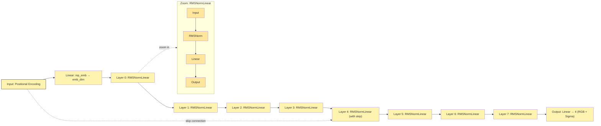

## Findings

### Stochasticity in Loss Curves

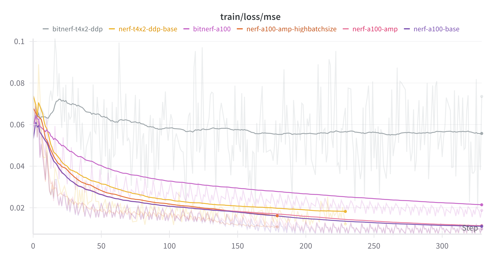

The loss curves we see across the board are originally quite **erratic**. This can generally be attributed to the use of a lower batch-size and ray-sampling rate (keeping compute constraints in mind), as well as the use of Quantization in the case of BitNeRF. This can be rectified with an increase in the `POS_ENCODE_DIMS` or `NUM_SAMPLES` parameter, and/or an increase in the batch-size. These steps would effectively increase the expressivity of the points being samples, or increase the number of points being sampled from each ray altogether.

### Gradient Scaling in AMP-enabled Training


As recommended by the [official PyTorch documentation](https://docs.pytorch.org/docs/stable/amp.html#gradient-scaling), we perform **Gradient Scaling** upon performing AMP-enabled training. This leads to our GradNorm graph being off-scale. We do gradient scaling because gradients in `fp16` can generally be quite small and thus **become negligible (underflow)** quite soon. Performing such positive-scaling allows for the gradients to be propagated across a deep network reliably.

### GPU Power-Consumption Patterns

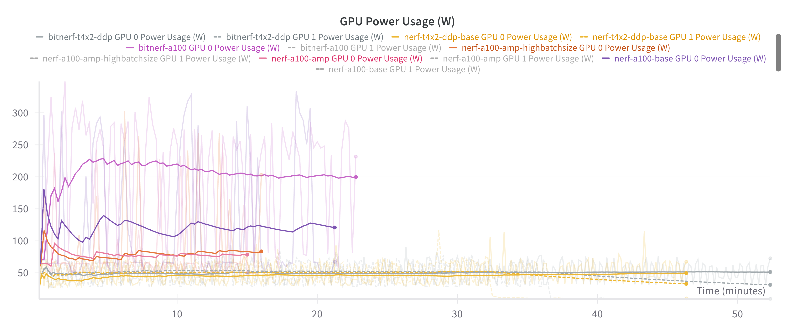

We can theorize that the distribution of workloads between both GPUs in the DDP-enabled nerf-base as well as bitnerf-base was not the best. As an example, the power consumption for GPU 0 v/s GPU 1 towards the end of the run was ~59 v/s ~9, **a 6.5x difference!** While considering this, also keep in mind that both DDP runs were made on a T4 instead of a A100 GPU.
On the other hand, we see that the BitNeRF run used considerably higher GPU power compared to the base NeRF run. This is attributed to the use of a **STE (Straight-Through Estimator)** during the BitNet-scale training. Since gradients cannot be well-represented in such low-bit values, we basically let the gradients flow through in full precision and apply the gradient as received, akin to using an identity function in the forward pass.

### Training Breakdown of Distributed Quantization-Aware NeRF

<div align="center">
  <div style="display: inline-block; width: 45%; margin: 0 10px;">
    <h3>Depth Map (BitNeRF-DDP-2xT4)</h3>
    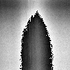
  </div>
  <div style="display: inline-block; width: 45%; margin: 0 10px;">
    <h3>Depth Map (BitNeRF-A100)</h3>
    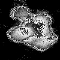
  </div>
</div>

The BitNeRF model shows great promise when trained on an A100. But upon running the same experiment with DDP on 2 x T4s, the training suffers catastrophic breakdown. The reason for such a breakdown is not known, although I hypothesize that it could have something to do with **divergent mean statistics** for the mini-batches that each of the GPUs receive upon performing DDP, which leads the `FakeQuantize` modules to then diverge in their training leading to the model learning from inconsistent signals and performing worse. Another fact is, based on the advice given in [#930](https://github.com/pytorch/ao/pull/930), we inject a `RMSNorm` layer before every `nn.Linear` layer. I have not done an investigation as to what happens if I do not do that, but I'd hazard a guess that it would lead to training instabilities.

### Quality of Depth-maps

<div align="center">
  <table>
    <tr>
      <td align="center">
        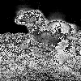<br>
        <sub>Depth Map (NeRF-A100)</sub>
      </td>
      <td align="center">
        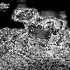<br>
        <sub>Depth Map (NeRF-A100-AMP)</sub>
      </td>
      <td align="center">
        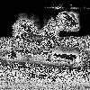<br>
        <sub>Depth Map (NeRF-AMP-HighBatchSize)</sub>
      </td>
    </tr>
    <tr>
      <td align="center">
        <br>
        <sub>Depth Map (BitNeRF-A100)</sub>
      </td>
      <td align="center">
        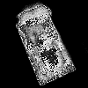<br>
        <sub>Depth Map (NeRF-DDP-2xT4)</sub>
      </td>
      <td align="center">
        <br>
        <sub>Depth Map (BitNeRF-DDP-2xT4)</sub>
      </td>
    </tr>
  </table>
</div>

Upon first-pass of the depth maps, we see that they are quite noisy. One possible reason for this can be a low ray-sampling rate leading to less depth information being propagated to the network. Also to note is the absolute breakdown of the depth-map in distributed low-bit training, as hypothesized in the section above.

### Effect of Batch Size on Overall Generation Quality and Training Dynamics

<div align="center">
  <div style="display: inline-block; width: 45%; margin: 0 10px;">
    <h3>Batch Size: 4</h3>
    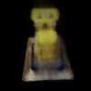
  </div>
  <div style="display: inline-block; width: 45%; margin: 0 10px;">
    <h3>Batch Size: 8</h3>
    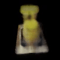
  </div>
</div>

The difference between the generated output and training dynamics with a change in batch-size is near-negligible. We see that the loss curves for the higher-batch-size run seems to converge quicker and the PSNR scores also grow faster with the same run, as expected. No surprises here!

For more information, feel free to [refer to the Weights & Biases dashboard here](https://wandb.ai/suvadityamuk/nerf/workspace)!

## Usage

First, execute `python data_setup.py` to set up the dataset on your machine. This should take a few seconds at best with a decent internet connection.

Then, you can try running each experiment as a separate Python script itself by executing `python exp_{num}.py`. The experiments are as follows:
- [`exp1.py`](exp1.py): A base run with a simple NeRF model on a single NVIDIA A100 40 GB GPU.
- [`exp2.py`](exp2.py): A run with the NeRF model undergoing naive automatic mixed-precision and gradient scaling.
- [`exp3.py`](exp3.py): An automatic mixed-precision NeRF model trained with data on a higher batch size.
- [`exp4.py`](exp4.py): A BitNeRF model undergoing low-bit-scale training on a single NVIDIA A100 40 GB GPU.
- [`exp5.py`](exp5.py): A simple NeRF model undergoing distributed training with Distributed DataParallel APIs on 2 x T4 GPUs.
- [`exp6.py`](exp6.py): A BitNeRF model undergoing distributed low-bit-scale training with Distributed DataParallel APIs on 2 x T4 GPUs.

### Example

```bash
python exp1.py  # For base NeRF
python exp6.py  # For BitNeRF with DDP
```

The training process will:
1. Load the dataset
2. Initialize the model
3. Train for the specified number of epochs
4. Save model checkpoints
5. Generate 360° videos periodically

Make changes to the WandB configuration to set up your own WandB workspace and account as per your requirement.

## Contributing

Contributions are welcome! Feel free to extend these results or scripts! I would particularly appreciate more ablations to be done in these experiments.

## License

[MIT](https://choosealicense.com/licenses/mit/)

## References

1. [Aritra Roy Gosthipaty and Ritwik Raha, Keras documentation: 3D Volumetric Rendering with NeRF, 2021](http://keras.io/examples/vision/nerf)
2. [Thien Tran, TorchAO, GitHub Pull Request (#930): BitNet b1.58 training](https://github.com/pytorch/ao/pull/930)
3. [Ben Mildenhall, Pratul P. Srinivasan, Matthew Tancik, Jonathan T. Barron, Ravi Ramamoorthi, and Ren Ng. Nerf: Representing scenes as neural radiance fields for view synthesis, 2020](https://arxiv.org/abs/2003.08934)
4. [Shuming Ma, Hongyu Wang, Lingxiao Ma, Lei Wang, Wenhui Wang, Shaohan Huang, Li Dong, Ruiping Wang, Jilong Xue, and Furu Wei. The era of 1-bit llms: All large language models are in 1.58 bits, 2024](https://arxiv.org/abs/2402.17764)

## Citation

If you use this code or find this work helpful in your research, please consider citing:

```bibtex
@misc{mukherjee2025nerfexperiments,
  author = {Mukherjee, Suvaditya},
  title = {NeRF Experiments: Implementations and Optimizations of Neural Radiance Fields},
  year = {2025},
  publisher = {GitHub},
  journal = {GitHub repository},
  howpublished = {\url{https://github.com/suvadityamuk/nerf-experiments}}
}
```

APA format:
```
Mukherjee, S. (2025). NeRF Experiments: Implementations and Optimizations of Neural Radiance Fields. GitHub. https://github.com/suvadityamuk/nerf-experiments
```

