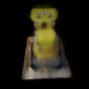
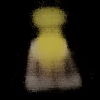
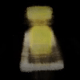

# NeRF Experiments 🌟

<h2 align="center">Neural Radiance Field Experiments 🧠💫</h2>

<div align="center">
  <div style="display: inline-block; width: 30%; text-align: center; margin: 0 10px;">
    <h3>NeRF-Base</h3>
    
  </div>
  <div style="display: inline-block; width: 30%; text-align: center; margin: 0 10px;">
    <h3>BitNeRF-Base</h3>
    
  </div>
  <div style="display: inline-block; width: 30%; text-align: center; margin: 0 10px;">
    <h3>BitNeRF-2xT4s-DDP</h3>
    
  </div>
</div>

This repository contains several implementations and optimizations of Neural Radiance Fields (NeRF) using PyTorch. The experiments explore different training configurations, optimization techniques, and quantization approaches for NeRF models.

## Overview 🔍

NeRF is a method that represents a 3D scene as a continuous volumetric function using a neural network. This implementation includes:

- Base NeRF implementation
- Optimizations with mixed precision training
- Distributed training with DDP (DistributedDataParallel)
- Quantization approaches using BitNet training [as introduced in this paper](https://arxiv.org/abs/2504.12285)

## Weights & Biases Dashboard 📊

Take a look at my [training logs here!](https://wandb.ai/suvadityamuk/nerf)

## Project Structure 📁

- [`nerf.py`](nerf.py) - Basic NeRF implementation
- [`bitnerf.py`](bitnerf.py) - Quantization-friendly NeRF implementation with RMSNorm
- [`bitnerf_ddp.py`](bitnerf_ddp.py) - DDP-compatible BitNeRF implementation
- [`dataset.py`](dataset.py) - Dataset handling for NeRF training
- [`utils.py`](utils.py) - Utility functions for rays, transforms, logging, etc.
- [`configs.py`](configs.py) - Configuration parameters for different experiments
- [`exp1.py`](exp1.py) through [`exp6.py`](exp6.py) - Different experiment scripts

## Experiments 🧪

1. **[`exp1.py`](exp1.py)** - Base NeRF implementation on single GPU
2. **[`exp2.py`](exp2.py)** - NeRF with mixed precision (BF16) training
3. **[`exp3.py`](exp3.py)** - NeRF with higher number of samples and regularization
4. **[`exp4.py`](exp4.py)** - BitNeRF with quantization-aware training
5. **[`exp5.py`](exp5.py)** - Multi-GPU training using DistributedDataParallel
6. **[`exp6.py`](exp6.py)** - BitNeRF with DDP and quantization

## Features ✨

- Positional encoding for better high-frequency detail representation
- Ray sampling and volumetric rendering
- Video rendering for 360° views
- Distributed training across multiple GPUs
- Quantization-aware training
- RMSNorm for improved quantization stability

## Requirements 🛠️

- PyTorch
- CUDA-compatible GPU
- Distributed training support
- numpy, tqdm

## Setting up 2 x T4 from Kaggle onto Colab 🚀

1. Navigate to [Kaggle](https://www.kaggle.com/) and open a [new Code notebook](https://www.kaggle.com/code)
2. Go to Settings > Accelerator Preferences > GPU T4 x2
3. Go to Run > Kaggle Jupyter Server and on the right-side pane, copy the "Colab-Compatible URL"
4. Navigate into [Colab](https://colab.new) now, and click on the drop-down button next to Connect (near the top-right side of the screen)
5. Choose "Connect to a local runtime" and enter the copied URL from Kaggle into it. Click "Connect".
6. You should now have the GPUs connected to your Colab system!

## Usage 🔧

Each experiment script can be executed directly:

```bash
python exp1.py  # For base NeRF
python exp6.py  # For BitNeRF with DDP
```

The training process will:
1. Load the dataset
2. Initialize the model
3. Train for the specified number of epochs
4. Save model checkpoints
5. Generate 360° videos periodically

Make changes to the WandB configuration to set up your own WandB workspace and account as per your requirement.

## Model Architecture 🏗️

The NeRF model architecture includes:
- Positional encoding input
- MLP with skip connections every 4 layers
- ReLU activation
- RGB (sigmoid) and density (ReLU) outputs
- Volume rendering for final image synthesis

BitNeRF additionally uses RMSNorm for better quantization compatibility.

## References 📚

This implementation borrows heavily (almost completely) from [this Keras.io tutorial](http://keras.io/examples/vision/nerf) written by [Aritra Roy Gosthipaty](https://x.com/ariG23498/) and [Ritwik Raha](https://x.com/ritwik_raha). I also refer to the following resources:

1. [PyTorch guide on Quantization-Aware Training](https://pytorch.org/blog/quantization-aware-training/)
2. [TorchAO documentation](https://pytorch.org/ao/stable/index.html)
3. [BitNet Training APIs - torchao Prototypes](https://github.com/pytorch/ao/blob/main/torchao/prototype/quantized_training/bitnet.py)
4. [PyTorch documentation on DistributedDataParallel](https://pytorch.org/docs/stable/notes/ddp.html)

## Citation 📝

If you use this code or find this work helpful in your research, please consider citing:

```bibtex
@misc{mukherjee2025nerfexperiments,
  author = {Mukherjee, Suvaditya},
  title = {NeRF Experiments: Implementations and Optimizations of Neural Radiance Fields},
  year = {2025},
  publisher = {GitHub},
  journal = {GitHub repository},
  howpublished = {\url{https://github.com/suvadityamuk/nerf-experiments}}
}
```

APA format:
```
Mukherjee, S. (2025). NeRF Experiments: Implementations and Optimizations of Neural Radiance Fields. GitHub. https://github.com/suvadityamuk/nerf-experiments
```

## Contributing 👥

Contributions are welcome! Feel free to extend these results or scripts!

## License ⚖️

[MIT](https://choosealicense.com/licenses/mit/)